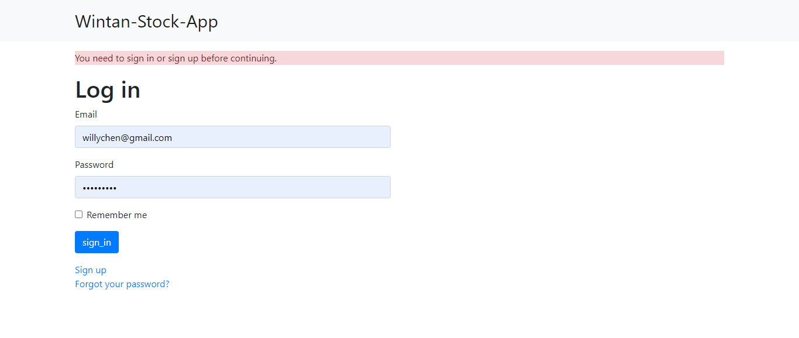
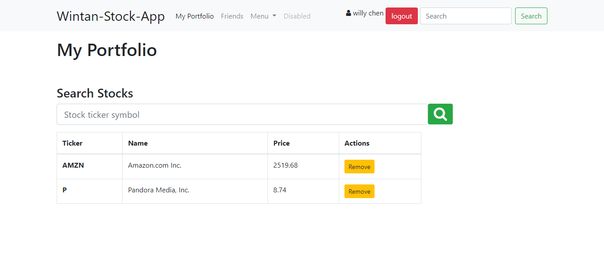
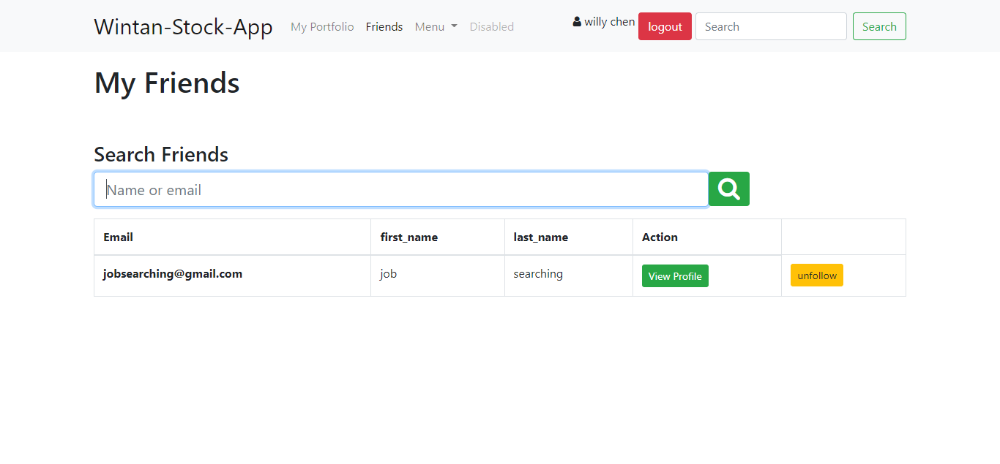

## Finance tracker
This project is a stock tracking app that helps you get stock price of most companies, it fetches it's result from Iex Api and it gives functionalities for searching through for stock prices by entering the right ticker symbol,and it goes ahead to give you the opportunity to add other users on the platform as friends, you can open another incognito page on the web and register two different users, then add the other as friend and vice versa.

This app implements quite a lot of ROR best practices which includes DRY,consistent MVC pattern and is going to be improved even as more ideas come to mind, but for now this is a functioning app that can serve you some market info of what shares to invest in.

[Live version](https://vast-peak-21140.herokuapp.com/)

## Built With

- Ruby on Rails
- Bootstrap
- Api
- Heroku

## Getting Started

To get a local copy up and running follow these simple example steps.

- Clone the repository and there you go! ;-)

### Prerequisites

- Get a browser like Chrome and Firefox in their most recent versions
- Code Editor (VSCode)

### Setup

- Open a terminal and run the command `git clone https://github.com/wintan1418/finance-tracker`
- cd react-calculator
- run `npm install`
- run `npm run build`
- Open the index.html file with any browser of your choice.

👤 Author

Oluwadare Juwon

- Github: [@Oluwadare Juwon](https://github.com/wintan1418)
- Linkedin: (www.linkedin.com/in/oluwintan)
- Twitter: [Oluwadare-juwon](https://twitter.com/@oluwadarejuwon)

## 🙋‍♂ show your support

give a ⭐️ if you like this project!

## 📝 license

This project is [MIT](LICENSE) licensed.